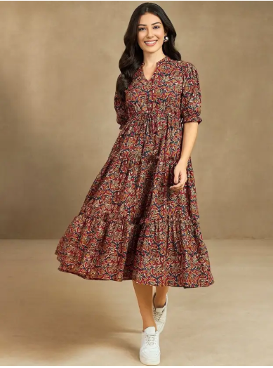
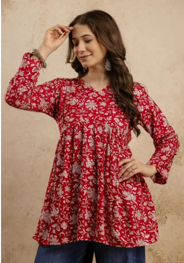

# Product_card
## Date:09.07.2025
## Objective:

To replicate a product card layout similar to those found on real-time e-commerce platform like FlipKart using the CSS Box Model (margin, border, padding, and content).

## Tasks:

#### 1. Structure the HTML Layout:
Create a container ```<div>``` for the product card.

Add an `````` for the product image.

Include ```<h2>``` for product name, ```<p>``` for description, and a ```<span>``` or ```<div>``` for price.

Add a “Buy Now” or “Add to Cart” button.

#### 2. Apply Box Model Styling in CSS:
Use padding inside each section (image, text, button) to ensure readability.

Use margin around the card to space it from the page edges or other cards.

Add a border to outline the card.

Control width and height for consistent sizing.

#### 3. Visual Styling:
Add a background color to the card container.

Use box-shadow to simulate depth (card lifting effect).

Add border-radius for rounded corners.

#### 4. Center the Card:
Use display: flex and justify-content: center and align-items: center on the parent container.

#### 5. Bonus Enhancements:
Use a hover effect on the button (e.g., background color change).

Make the card responsive with percentage-based widths or media queries.
## HTML Code:
```
<!DOCTYPE html>
<html>
<head>
  <title>Flipkart Product Cards</title>
  <link rel="stylesheet" href="style.css">
</head>
<body>
  <h1 class="caption">Flipkart-Product</h1>
  <div class="container">
    <div class="product-card">
      
      <h2>Bodycon</h2>
      <p>A tight-fitting dress that hugs the body’s curves for a sleek, bold look.</p>
      <div class="price">₹510</div>
      <button>Buy Now</button>
      <button class="cart-btn">Add to Cart</button>
    </div>

    <div class="product-card">
      
      <h2>Fit and Flare</h2>
      <p>A dress style fitted at the waist and flaring out at the hem, giving a flattering silhouette.</p>
      <div class="price">₹1,500</div>
      <button>Buy Now</button>
      <button class="cart-btn">Add to Cart</button>
    </div>

    <div class="product-card">
      
      <h2>Kurta</h2>
      <p> A traditional tunic worn with leggings or pants, blending comfort and elegance.</p>
      <div class="price">₹1,599</div>
      <button>Buy Now</button>
      <button class="cart-btn">Add to Cart</button>
    </div>

    <div class="product-card">
      
      <h2>Churidar</h2>
      <p> A fitted trouser paired with long tops, known for its snug, gathered look at the ankles.</p>
      <div class="price">₹2,999</div>
      <button>Buy Now</button>
      <button class="cart-btn">Add to Cart</button>
    </div>
     <div class="product-card">
      
      <h2>Crop Top</h2>
      <p>A short top that shows the midriff, popular for casual or trendy outfits.</p>
      <div class="price">₹999</div>
      <button>Buy Now</button>
      <button class="cart-btn">Add to Cart</button>
    </div>
  </div>
</body>
</html>
```
## CSS Code:
```
body, html {
  height: 100%;
  margin: 0;
  background-color:grey; 
}

.caption {
  text-align: center;
  color: yellow; 
  font-size: 32px;
  margin-top: 20px;
}

.container {
  display: flex;
  justify-content: center;
  align-items: center;
  flex-wrap: wrap; 
  padding: 20px;
}
.product-card {
  background-color:blanchedalmond;
  border: 1px solid whitesmoke;
  border-radius: 10px;
  box-shadow: 0 4px 8px rgba(0,0,0,0.1);
  padding: 20px;
  margin: 20px;
  width: 250px;
  box-sizing: border-box; 
  text-align: center;
}

.product-card img {
  width: 100%;
  height: auto;
  border-radius: 8px;
  margin-bottom: 15px;
}

.product-card h2 {
  font-size: 20px;
  margin: 10px 0;
}

.product-card p {
  font-size: 14px;
  color: #555;
  margin: 10px 0;
}

.product-card .price {
  font-size: 18px;
  color: #e53935;
  margin: 10px 0;
}

.product-card button {
  background-color: #2874f0;
  color: #fff;
  border: none;
  padding: 10px 20px;
  border-radius: 5px;
  cursor: pointer;
  transition: background-color 0.3s;
}

.product-card button:hover {
  background-color: beige;
}

@media (max-width: 500px) {
  .product-card {
    width: 90%;
  }
}
```
## Output:


## Result:
A product card layout similar to those found on real-time e-commerce platform like FlipKart using the CSS Box Model is replicated successfully.
